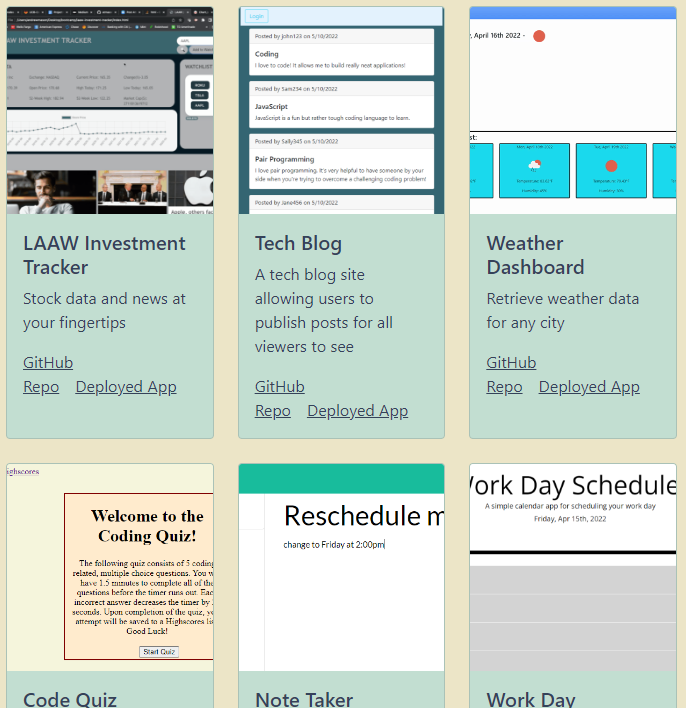

# My Portfolio

## **Deployed Link**

Please click on the following link to be navigated to the portfolio: https://luccaloopz.github.io/react-portfolio/

## **Contact Info**

* `Email:` luccamartins2012@gmail.com
* `GitHub Profile:` https://github.com/luccaloopz

## **Languages Used**

* 
* 
* 

## **Description**

The purpose of this project was to use React to build a portfolio showcasing some of my newer coding projects. The site includes an "About Me" section where the visitor will find a picture of myself as well as a small blurb describing myself as a software developer, a "Contact" section, a "Portfolio" section in which to view six of my coding projects, and a "Resume" section where they can find a link to my downloadable resume along with my technical proficiencies. 

## **Application**

Picture of the nav bar as well as the About Me section

Picture of the project cards

## **LICENSE**

The following application is covered under the MIT License.